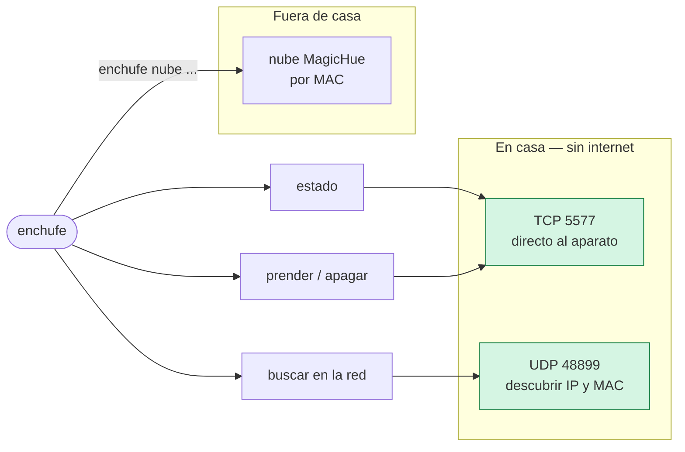
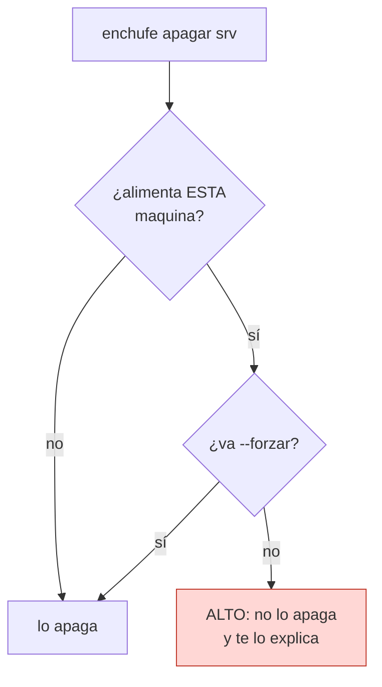

# enchufe

**Controla enchufes WiFi Zengge/MagicHome desde la terminal.** En casa habla
directo con el aparato por TCP, sin pasar por ninguna nube ni guardar llaves; y
cuando no estás en casa, por la nube de MagicHue/Briturn.

Son los enchufes que venden bajo muchas marcas (Vanance, y otras) con las apps
**Briturn** o **MagicHue**. Por dentro todos hablan el protocolo **LEDENET** de
Zengge. **No son Tuya**, aunque se parezcan.

## Por qué

Las apps de estos enchufes te obligan a pasar por su nube hasta para prender la
lámpara que tienes a un metro. `enchufe` habla **directo** con el aparato por la
red local: más rápido, funciona aunque se caiga internet, y nada de tu casa sale
a ningún servidor. La nube queda solo para cuando de verdad estás fuera.

## Dos caminos



En verde, lo que no toca internet. Lo local es lo normal; la nube es la
excepción para cuando estás fuera.

## El seguro que no se salta solo

Si marcas un enchufe como el que **alimenta la máquina desde la que corres el
comando**, `enchufe` se niega a apagarlo desde ahí: apagarlo sería cortarte la
corriente en caliente a ti mismo. Hace falta `--forzar` para pasar por encima.



Esto está fijado por pruebas: si alguien rompe el seguro sin querer, salen en
rojo.

## Qué hace falta

| | |
|---|---|
| **Los enchufes** | Zengge/MagicHome (LEDENET). Marcas como Vanance, con las apps Briturn o MagicHue. Tienen que estar en tu **WiFi de 2.4 GHz** |
| **Windows** | La contraseña de la nube, si decides guardarla, se cifra con **DPAPI**, que es de Windows. El resto es multiplataforma, pero guardar la clave y los acentos en consola asumen Windows |
| **Python** | 3.9 o más nuevo |
| **Internet** | Solo para el modo nube. Lo local funciona sin conexión |

## Instalación

```bash
pip install git+https://github.com/leostriker111/Enchufe.git
```

Deja el comando `enchufe`. Para trabajar sobre el código:

```bash
git clone https://github.com/leostriker111/Enchufe.git && cd Enchufe && pip install -e ".[dev]"
```

## Uso

```bash
# En casa (directo, sin internet)
enchufe buscar                 barre la red y registra lo que encuentre
enchufe estado                 ¿prendido o apagado?
enchufe prender sala
enchufe apagar sala

# Desde fuera (por la nube)
enchufe nube login             entra con tu cuenta de Briturn/MagicHue
enchufe nube login --recordar  además cifra tu clave con DPAPI
enchufe nube estado
enchufe nube prender sala
enchufe nube ciclo sala 15     apaga, espera 15 s y prende

# Otros
enchufe log                    la bitácora (nunca guarda contraseñas)
enchufe donde                  dónde vive cada archivo
```

El alias de cada enchufe se cambia en el `enchufes.json` que `buscar` deja en
`%LOCALAPPDATA%\enchufe`.

## Dónde vive cada cosa

El código y **tus datos van aparte**: la config, la sesión y la bitácora se
guardan en `%LOCALAPPDATA%\enchufe`, nunca junto al programa. La contraseña,
si la guardas, se cifra con DPAPI: queda atada a tu cuenta de Windows y no se
puede leer desde otra cuenta ni copiando el archivo a otra máquina.

## Lo que todavía no funciona

Un límite honesto vale más que una promesa falsa.

| Qué | Estado |
|---|---|
| **Solo enciende y apaga** | No controla color, brillo ni temperatura, aunque el aparato y las librerías puedan. Estos son enchufes, no focos RGB |
| **Sin pruebas contra hardware** | Lo que habla con los enchufes (TCP 5577, UDP 48899, la nube) no se puede probar sin un aparato real. Las pruebas cubren la lógica: el seguro, los alias, la config, el cifrado |
| **La nube es la de MagicHue** | Si tu marca usa otro servidor, el `login` fallará. El mensaje de error lo dice y pide reportarlo |
| **Guardar la clave es solo Windows** | Depende de DPAPI. En otro sistema, `--recordar` no tendría dónde cifrarla |
| **WiFi de 2.4 GHz** | Estos aparatos no ven las redes de 5 GHz. Es del hardware, no del programa |
| **`buscar` es por barrido** | Recorre las 254 direcciones de tu subred en el puerto 5577. Si tu red es rara (varias subredes, aislamiento de clientes), puede no encontrarlos |

## Desarrollo

```bash
pip install -e ".[dev]"
pytest pruebas/ -v
```

Las pruebas no tocan la red ni necesitan un enchufe. La prueba de cifrado solo
corre en Windows (DPAPI); en otros sistemas se salta sola.

## Créditos

El trabajo pesado lo hacen dos librerías: **flux_led** (control local LEDENET) y
**magichue** (la nube). Esto es la capa de encima: los alias, el seguro, la
bitácora y una línea de comandos cómoda.

## Licencia

[AGPL-3.0](LICENSE). Puedes usarlo, estudiarlo, modificarlo y distribuirlo; si
lo ofreces como servicio por red, tienes que publicar tu código también.
